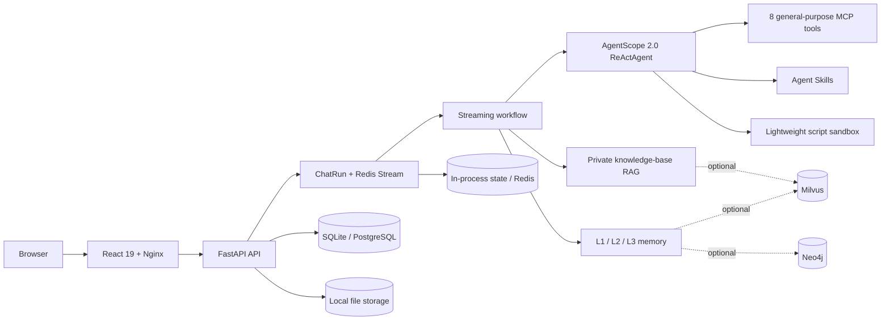

<p align="center">
  
</p>

<h1 align="center">HugAgentOS</h1>

<p align="center">
  <strong>The open-source, self-hosted workspace for AI agents</strong>
</p>

<p align="center">
  Give models the context and tools to retrieve knowledge, work with files,
  run code, and carry real tasks through to completion.
</p>

<p align="center">
  <a href="./README.md">English</a> ·
  <a href="./README_CN.md">简体中文</a>
</p>

<!-- Keep these stable launch URLs so they can go live without another README redesign. -->
<p align="center">
  <a href="https://hugagentos.com">Website</a> ·
  <a href="https://app.hugagentos.com">Try HugAgentOS online</a>
</p>

<p align="center">
  <a href="./LICENSE">
    
  </a>
  <a href="./document/en/editions/overview.md">
    
  </a>
  <a href="./document/en/deployment/quick-install.md">
    
  </a>
  <a href="./document/en/architecture/overview.md">
    
  </a>
  <a href="./document/en/modules/mcp-tools.md">
    
  </a>
</p>

HugAgentOS brings agentic chat, private knowledge-base RAG, sub-agents, MCP
tools, Agent Skills, sandboxed execution, long-term memory, automation, and a
data canvas into one self-hosted web workspace. Connect your own models and
data, start with a conversation, and grow it into an agent system you control.

<p align="center">
  
</p>

> [!NOTE]
> This Community repository is generated from the upstream main repository for
> each release and is marked `generated`. Report changes to `src/**` through an
> Issue or Discussion. Pull requests for documentation and examples are
> welcome. See [CONTRIBUTING.md](./CONTRIBUTING.md) for details.

## Quick start

Install the personal, single-machine profile on Linux, macOS, or WSL2 with one
command. You need Python 3.10 or later, Node.js 20 or later, Git, and access to
an LLM API. You don't need Docker, PostgreSQL, or Redis.

```bash
curl -fsSL https://raw.githubusercontent.com/ZJU-REAL/HugAgentOS/main/install.sh | bash
```

The installer clones HugAgentOS into `~/.hugagent/source`, creates an isolated
Python environment, installs the dependencies, builds the web application, and
opens the first-run wizard. Follow the prompts to create an administrator and
connect an OpenAI-compatible or local model. HugAgentOS then opens at
[http://127.0.0.1:3001](http://127.0.0.1:3001).

Start HugAgentOS again at any time with this command:

```bash
~/.hugagent/venv/bin/hugagent
```

> [!NOTE]
> The one-command profile is designed for personal trials and development. It
> uses SQLite, in-process state, and a local subprocess sandbox. For teams or
> production, use the [Docker Compose deployment
> guide](./document/en/deployment/docker-compose.md).

For installer options, capability boundaries, and troubleshooting, read the
[no-Docker installation guide](./document/en/deployment/quick-install.md).

## From answers to outcomes

HugAgentOS isn't another wrapper around a chat box. It puts the context,
execution environment, and artifact management an agent needs into one task
flow.

<table>
  <tr>
    <td width="50%" valign="top">
      <strong>🔌 Bring your model</strong><br />
      Connect cloud or local models through one provider layer without locking
      the application to a single vendor.
    </td>
    <td width="50%" valign="top">
      <strong>🛠️ Take action</strong><br />
      ReAct orchestration combines MCP, skills, and a sandbox to search,
      analyze, create files, and call external capabilities.
    </td>
  </tr>
  <tr>
    <td width="50%" valign="top">
      <strong>🧠 Retain context</strong><br />
      Private knowledge bases and layered memory provide context across files
      and conversations.
    </td>
    <td width="50%" valign="top">
      <strong>🏠 Own your data</strong><br />
      Run the application, databases, and file storage on infrastructure you
      control.
    </td>
  </tr>
</table>

## Core capabilities

Community Edition covers the complete personal-agent loop from conversation
and execution to retention and reuse. Optional infrastructure stays optional
during the first run.

<table>
  <tr>
    <td width="50%" valign="top">
      <strong>💬 Agentic chat and Plan Mode</strong><br />
      SSE streaming, ReAct tool orchestration, deep thinking, Plan Mode,
      traceable citations, and resumable streams.
    </td>
    <td width="50%" valign="top">
      <strong>📚 Private knowledge-base RAG</strong><br />
      Document ingestion and chunking, hybrid vector and keyword retrieval,
      optional reranking, and private knowledge isolation.
    </td>
  </tr>
  <tr>
    <td width="50%" valign="top">
      <strong>🤝 Personal sub-agents</strong><br />
      Create agents with focused roles, then collaborate through automatic
      routing or <code>@</code> mentions.
    </td>
    <td width="50%" valign="top">
      <strong>🔧 MCP tool ecosystem</strong><br />
      Built-in web search, page fetching, knowledge retrieval, charts, reports,
      batch jobs, automation, and skill management.
    </td>
  </tr>
  <tr>
    <td width="50%" valign="top">
      <strong>🧩 Agent Skills</strong><br />
      Extend agents with structured instructions and scripts through bundled
      skills, a skill marketplace, and personal skills.
    </td>
    <td width="50%" valign="top">
      <strong>⚙️ Automation and batch execution</strong><br />
      Create scheduled tasks in natural language or apply one workflow across
      spreadsheets, Word documents, and file lists.
    </td>
  </tr>
  <tr>
    <td width="50%" valign="top">
      <strong>🧪 Sandbox and artifacts</strong><br />
      Run code in a local subprocess or lightweight container sandbox, then
      create charts, reports, Office files, websites, and data-canvas artifacts.
    </td>
    <td width="50%" valign="top">
      <strong>🧠 Three-tier personal memory</strong><br />
      Store the L1 personal profile in the relational database, with optional
      Milvus vector memory and Neo4j graph memory.
    </td>
  </tr>
  <tr>
    <td width="50%" valign="top">
      <strong>🗂️ Personal workspace</strong><br />
      Organize long-running work with projects, folders, favorites, shared
      conversations, and an artifact center.
    </td>
    <td width="50%" valign="top">
      <strong>📊 Data canvas</strong><br />
      Inspect and edit structured data inside the conversation so the analysis
      and final result stay in one workspace.
    </td>
  </tr>
</table>

## Architecture

HugAgentOS separates web access, chat runs, orchestration, and tool execution.
The local profile uses SQLite and in-process state; the multi-user profile uses
PostgreSQL and Redis. Milvus and Neo4j join the stack only when you enable the
optional memory profile.



### Technology stack

The project combines mature, replaceable open-source components behind clear
service boundaries.

| Layer | Main technologies |
|---|---|
| Agent runtime | AgentScope 2.0, ReAct, Model Context Protocol |
| Backend | Python, FastAPI, SQLAlchemy, Alembic |
| Frontend | React 19, TypeScript, Vite, Zustand, Ant Design |
| Data and state | SQLite or PostgreSQL 15, in-process state or Redis 7, local file storage |
| Optional memory | Milvus 2.4, Neo4j 5 Community, mem0 |
| Deployment | One-command local installer, Docker Compose, Nginx |

See the [architecture overview](./document/en/architecture/overview.md) for the
full request lifecycle, container topology, and design decisions.

## Community and Enterprise editions

Community Edition gives an individual a complete agent workspace. Enterprise
Edition adds the governance, collaboration, and delivery capabilities needed
to operate the same experience across an organization. Enterprise-only source
is physically absent from the Community tree.

| Community Edition | Enterprise Edition adds |
|---|---|
| Agentic chat, Plan Mode, and personal sub-agents | Teams, organization agents, and permission matrices |
| 8 general MCP tools, personal skills, and a skill marketplace | Industry data tools, organization governance, and skill review |
| Private knowledge bases and three-tier personal memory | Public knowledge administration and memory auditing |
| Automation, batch execution, and a personal data canvas | Organization billing, usage reports, and canvas collaboration |
| Lightweight sandbox and local file storage | Persistent sandboxes, cloud storage, and offline delivery |
| Local accounts and branding with Powered-by attribution | SSO, compliance auditing, and full white-labeling |

See the [edition overview](./document/en/editions/overview.md) for the complete
feature boundary and upgrade path.

## Documentation

The repository includes complete English and Chinese documentation for
operators, users, and contributors, and you can read it offline.

| Goal | English | 中文文档 |
|---|---|---|
| Understand the product | [Introduction](./document/en/getting-started/introduction.md) | [产品简介](./document/zh-CN/getting-started/introduction.md) |
| Run it in 10 minutes | [Quick start](./document/en/getting-started/quick-start.md) | [快速开始](./document/zh-CN/getting-started/quick-start.md) |
| Configure a deployment | [Deployment](./document/en/deployment/README.md) | [部署指南](./document/zh-CN/deployment/README.md) |
| Explore the system design | [Architecture](./document/en/architecture/overview.md) | [架构总览](./document/zh-CN/architecture/overview.md) |
| Learn MCP, skills, memory, and sandboxing | [Modules](./document/en/README.md#modules) | [功能模块](./document/zh-CN/README.md#功能模块) |
| Build backend or frontend features | [Development](./document/en/README.md#development) | [开发指南](./document/zh-CN/README.md#开发指南) |

Start from [document/README.md](./document/README.md) to browse every guide.

## Contributing

We welcome bug reports, feature proposals, documentation improvements, and
reproducible patches. Read [CONTRIBUTING.md](./CONTRIBUTING.md) before you
start so you understand the boundary between generated and directly editable
content.

- Include reproduction steps, expected behavior, actual behavior, and your
  environment in bug reports.
- Explain the concrete use case and problem when proposing a feature.
- Keep English and Chinese documentation aligned with the Community and
  Enterprise edition boundary.

Don't open a public Issue for a security vulnerability. Follow
[SECURITY.md](./SECURITY.md) to report it through a private channel.

## License

HugAgentOS Community Edition is licensed under Apache License 2.0 with
supplementary terms. The terms restrict operating the software as a competing
multi-tenant SaaS offering and require the UI's Powered-by attribution to
remain visible. [LICENSE](./LICENSE) and [NOTICE](./NOTICE) define the complete
rights and obligations for internal use, modification, and distribution.
