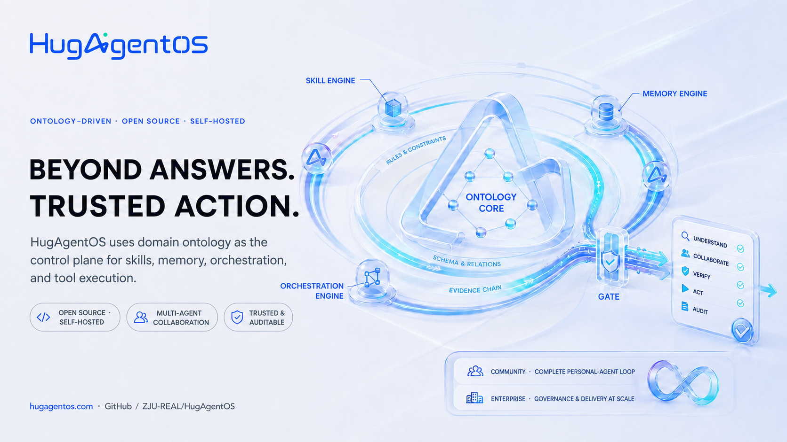
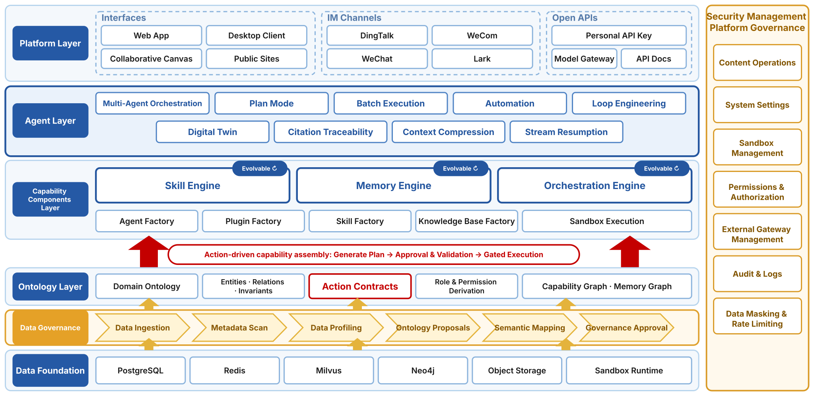

<p align="center">
  
</p>

<p align="center">
  <strong>HugAgentOS: The Enterprise AgentOS for Ontology-Grounded Trustworthy Reasoning</strong>
</p>

<p align="center">
  The open-source, self-hosted foundation for enterprise AI agents
</p>

<p align="center">
  Give models the context and tools to retrieve knowledge, work with files,
  run code, and carry real tasks through to completion.
</p>

<p align="center">
  
</p>

<p align="center">
  <a href="./README.md">English</a> ·
  <a href="./README_CN.md">简体中文</a>
</p>

<!-- Keep these stable launch URLs so they can go live without another README redesign. -->
<p align="center">
  <a href="https://hugagentos.com">Website</a> ·
  <a href="https://app.hugagentos.com">Try HugAgentOS online</a>
</p>

<p align="center">
  <a href="./LICENSE">
    
  </a>
  <a href="./document/en/editions/overview.md">
    
  </a>
  <a href="./document/en/deployment/quick-install.md">
    
  </a>
  <a href="./document/en/architecture/overview.md">
    
  </a>
  <a href="./document/en/modules/mcp-tools.md">
    
  </a>
</p>

HugAgentOS is an enterprise-grade AgentOS that treats domain ontology as a
control plane for agent reasoning, decisions, and actions. Its open-source
Community Edition combines agentic chat, private knowledge-base RAG,
sub-agents, MCP tools, Agent Skills, sandboxed execution, long-term memory,
automation, and a data canvas in one self-hosted workspace.

> [!NOTE]
> This Community repository is generated from the upstream main repository for
> each release and is marked `generated`. Report changes to `src/**` through an
> Issue or Discussion. Pull requests for documentation and examples are
> welcome. See [CONTRIBUTING.md](./CONTRIBUTING.md) for details.

<p align="center">
  
</p>

<p align="center">
  <sub>60-second product tour ·
  <a href="https://github.com/ZJU-REAL/HugAgentOS/raw/main/assets/hugagentos-promo-en.mp4">full video with sound</a></sub>
</p>

## Quick start

Use the one-command install to try it out, or Docker Compose for a long-running
service with isolation. Either way you need an OpenAI-compatible or local model.
**The initial account and password are both `admin` and must be changed on first
sign-in; the Community Edition has no self-registration.**

### Option 1: one-command install (Linux / macOS / WSL2)

Requires Python 3.11+, Node.js 20+, Git and `curl`. No Docker, PostgreSQL or
Redis needed.

```bash
curl -fsSL https://raw.githubusercontent.com/ZJU-REAL/HugAgentOS/main/install.sh | bash
```

The installer fetches the source into `~/.hugagent/source`, creates an isolated
Python environment, builds the web application and walks you through first-run
setup; it then opens [http://127.0.0.1:3001](http://127.0.0.1:3001). Start it
again later with `~/.hugagent/venv/bin/hugagent`.

> [!WARNING]
> The installation listens on `127.0.0.1` only. If you genuinely need remote
> access, use `hugagent serve --host 0.0.0.0 --port 3001 --no-browser`, and set a
> strong password, a firewall and HTTPS first. Do not expose it on an untrusted
> network.

This path uses SQLite, in-process state and a local subprocess sandbox, which
suits personal use and development. Options and troubleshooting are in the
[one-command install guide](./document/en/deployment/quick-install.md).

### Option 2: Docker Compose

Use this when you need PostgreSQL, Redis, an isolated sandbox and persistent
volumes. Requires Git, Docker and Compose v2.

```bash
git clone https://github.com/ZJU-REAL/HugAgentOS.git
cd HugAgentOS
cp .env.example .env
mkdir -p data/storage
docker compose up -d --build
```

Open [http://localhost:3002](http://localhost:3002), then connect a model under
**Settings → System → Model services**. Profiles, persistence and production
configuration are covered in the
[Docker Compose deployment guide](./document/en/deployment/docker-compose.md).

## Why HugAgentOS

The point is not another chat wrapper. It is putting the context, the execution
capability, and the artifact management an agent needs to finish real work on a
single path — and raising the domain ontology from a knowledge base to a
**machine-executable control plane**, so that governed concepts, relations, rules
and action contracts give the skill, memory and orchestration engines one shared
business vocabulary.

<table>
  <tr>
    <td width="50%" valign="top">
      <strong>🔌 Model-agnostic</strong><br />
      Connect cloud or local models through one model-service configuration,
      without locking the application to a single vendor.
    </td>
    <td width="50%" valign="top">
      <strong>🛠️ Actually does the work</strong><br />
      ReAct orchestrates MCP servers, skills and sandboxes, so the model can
      search, analyse, produce files and call external capabilities.
    </td>
  </tr>
  <tr>
    <td width="50%" valign="top">
      <strong>🧠 Knowledge and memory</strong><br />
      Private knowledge bases and layered memory supply long-term context across
      files and conversations.
    </td>
    <td width="50%" valign="top">
      <strong>🏠 Your data stays yours</strong><br />
      Application, database and file storage all run on your own infrastructure.
    </td>
  </tr>
  <tr>
    <td width="50%" valign="top">
      <strong>🛡️ Gated, trustworthy execution</strong><br />
      Candidate plans pass deterministic rule checks, risk-tiered evidence review
      and a gate. A violating action returns with the rule, the evidence and a
      correction — it is never waved through silently.
    </td>
    <td width="50%" valign="top">
      <strong>🔎 Traceable evolution</strong><br />
      Approvals, rejections, evidence and outcomes are all recorded, distilled
      into versioned ontology proposals that take effect only after human review,
      and can be rolled back.
    </td>
  </tr>
</table>

> [!NOTE]
> The ontology trust control plane is an enterprise target architecture being
> integrated into the existing harness in stages. It strengthens structured
> compliance and evidence-based review; it does not promise "zero hallucination"
> for free text.

## Core capabilities

The Community Edition covers the full loop for a personal agent — conversation,
execution, consolidation and reuse. Optional components are enabled as needed.

| Capability | What it gives you |
|---|---|
| 💬 **Conversation and plan mode** | SSE streaming, ReAct tool orchestration, deep thinking, plan mode, citations, resumable runs |
| 📚 **Private knowledge base RAG** | Document chunking, hybrid vector and keyword retrieval, optional reranking, per-user isolation |
| 🤝 **Personal sub-agents** | Sub-agents with distinct roles, reached by automatic routing or an `@` mention |
| 🔧 **MCP tool ecosystem** | Built-in web search, page fetch, knowledge retrieval, charts, reports, batch runs, automation, skill management |
| 🧩 **Agent Skills** | Extend the agent with standardised skill definitions and scripts — built-in, marketplace and personal |
| ⚙️ **Automation and batch runs** | Create scheduled tasks in natural language; run one process across an Excel sheet, a Word file or a file list |
| 💬 **Group chat channels** | Feishu / DingTalk / WeCom bots, with optional group listening and history retrieval so the agent can see the conversation around it |
| 🧪 **Sandbox and artifacts** | Run code in a subprocess or lightweight container sandbox, producing charts, reports, Office files, web pages and data canvases |
| 🧠 **Three-layer personal memory** | L1 profile in the relational store; optional Milvus vector memory and Neo4j graph memory |
| 🧬 **Personal evolution** | Settle memory and skills out of your real work, each approved individually before it applies to you, and switchable off |
| 🗂️ **Personal workspace** | Projects, folders, favourites, conversation sharing and an artifact center |
| 📊 **Data canvas** | Inspect and edit structured data inside the conversation, keeping analysis and result in one workspace |

## Architecture

HugAgentOS separates user channels, agent workflows, reusable capability
engines, ontology contracts, data governance, and infrastructure into clear
layers. Action contracts connect the ontology layer to planning, validation,
and gated execution, while security and platform governance span the complete
stack.



> [!NOTE]
> The diagram shows the complete HugAgentOS product architecture. Some
> governance, collaboration, gateway, and persistent-sandbox capabilities are
> available only in Enterprise Edition.

### Technology stack

The project combines mature, replaceable open-source components behind clear
service boundaries.

| Layer | Main technologies |
|---|---|
| Agent runtime | AgentScope 2.0, ReAct, Model Context Protocol |
| Backend | Python, FastAPI, SQLAlchemy, Alembic |
| Frontend | React 19, TypeScript, Vite, Zustand, Ant Design |
| Data and state | SQLite or PostgreSQL 15, in-process state or Redis 7, local file storage |
| Optional memory | Milvus 2.4, Neo4j 5 Community, mem0 |
| Deployment | One-command local installer, Docker Compose, Nginx |

See the [architecture overview](./document/en/architecture/overview.md) for the
full request lifecycle, container topology, and design decisions.

## Community and Enterprise editions

Community Edition gives an individual a complete agent workspace. Enterprise
Edition adds the governance, collaboration, and delivery capabilities needed
to operate the same experience across an organization. Enterprise-only source
is physically absent from the Community tree.

| Community Edition | Enterprise Edition adds |
|---|---|
| Agentic chat, Plan Mode, and personal sub-agents | Teams, organization agents, and permission matrices |
| 8 general MCP tools, personal skills, and a skill marketplace | Industry data tools, organization governance, and skill review |
| Private knowledge bases and three-tier personal memory | Public knowledge administration and memory auditing |
| Automation, batch execution, and a personal data canvas | Organization billing, usage reports, and canvas collaboration |
| Lightweight sandbox and local file storage | Persistent sandboxes, cloud storage, and offline delivery |
| Local accounts and branding with Powered-by attribution | SSO, compliance auditing, and full white-labeling |

See the [edition overview](./document/en/editions/overview.md) for the complete
feature boundary and upgrade path.

## Documentation

The repository includes complete English and Chinese documentation for
operators, users, and contributors, and you can read it offline.

| Goal | English | 中文文档 |
|---|---|---|
| Understand the product | [Introduction](./document/en/getting-started/introduction.md) | [产品简介](./document/zh-CN/getting-started/introduction.md) |
| Run it in 10 minutes | [Quick start](./document/en/getting-started/quick-start.md) | [快速开始](./document/zh-CN/getting-started/quick-start.md) |
| Configure a deployment | [Deployment](./document/en/deployment/README.md) | [部署指南](./document/zh-CN/deployment/README.md) |
| Explore the system design | [Architecture](./document/en/architecture/overview.md) | [架构总览](./document/zh-CN/architecture/overview.md) |
| Build a domain ontology | [Domain ontology quickstart](./document/en/getting-started/domain-ontology-quickstart.md) | [快速构建领域本体](./document/zh-CN/getting-started/domain-ontology-quickstart.md) |
| Learn MCP, skills, memory, and sandboxing | [Modules](./document/en/README.md#modules) | [功能模块](./document/zh-CN/README.md#功能模块) |
| Build backend or frontend features | [Development](./document/en/README.md#development) | [开发指南](./document/zh-CN/README.md#开发指南) |

Start from [document/README.md](./document/README.md) to browse every guide.

## Roadmap

1. **Seamless cloud/local switching across clients** — one server deployment
   serving multiple clients, keeping conversations, agents, skills, files and task
   state in sync.
2. **Adaptive model routing based on Mixture of Agents** — select or combine models
   by task complexity, modality, latency and cost: light models for simple work,
   stronger ones only when the task warrants it.
3. **A richer extension ecosystem** — more built-in and community agents, skills,
   MCP servers and plugins, with better discovery, installation, updates, and
   quality and security review.

## Contributing

We welcome bug reports, feature proposals, documentation improvements, and
reproducible patches. Read [CONTRIBUTING.md](./CONTRIBUTING.md) before you
start so you understand the boundary between generated and directly editable
content.

- Include reproduction steps, expected behavior, actual behavior, and your
  environment in bug reports.
- Explain the concrete use case and problem when proposing a feature.
- Keep English and Chinese documentation aligned with the Community and
  Enterprise edition boundary.

Don't open a public Issue for a security vulnerability. Follow
[SECURITY.md](./SECURITY.md) to report it through a private channel.

## License

HugAgentOS Community Edition is licensed under Apache License 2.0 with
supplementary terms. The terms restrict operating the software as a competing
multi-tenant SaaS offering and require the UI's Powered-by attribution to
remain visible. [LICENSE](./LICENSE) and [NOTICE](./NOTICE) define the complete
rights and obligations for internal use, modification, and distribution.
