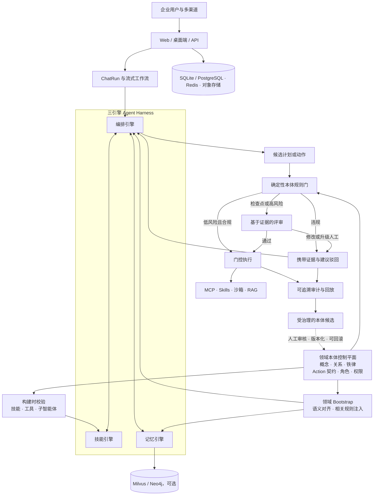

<h1 align="center">HugAgentOS</h1>

<p align="center">
  <strong>HugAgent：面向企业的本体驱动可信推理 AgentOS</strong>
</p>

<p align="center">
  面向企业智能体的开源、自托管底座
</p>

<p align="center">
  让模型不只回答问题，还能检索知识、调用工具、处理文件、运行代码，
  并持续完成真实任务。
</p>

<p align="center">
  <a href="./README.md">English</a> ·
  <a href="./README_CN.md">简体中文</a>
</p>

<!-- 预留稳定的上线地址，官网与在线体验启用后无需重新调整 README 结构。 -->
<p align="center">
  <a href="https://hugagentos.com">官方网站</a> ·
  <a href="https://app.hugagentos.com">在线使用</a>
</p>

<p align="center">
  <a href="./LICENSE">
    
  </a>
  <a href="./document/zh-CN/editions/overview.md">
    
  </a>
  <a href="./document/zh-CN/deployment/quick-install.md">
    
  </a>
  <a href="./document/zh-CN/architecture/overview.md">
    
  </a>
  <a href="./document/zh-CN/modules/mcp-tools.md">
    
  </a>
</p>

HugAgentOS 是 HugAgent 的开源底座。HugAgent 面向企业级智能体场景，把领域本体
提升为推理、决策与行动的控制平面，并将智能对话、私有知识库 RAG、子智能体、
MCP 工具、Agent Skills、沙箱执行、长期记忆、自动化和数据画布整合到一个
可私有部署的工作空间中。

> [!NOTE]
> 本社区仓库由上游主仓按发布版本自动生成，并标记为 `generated`。
> `src/**` 的修改请通过 Issue 或 Discussion 反馈；文档与示例欢迎直接提交 PR。
> 详细规则见 [CONTRIBUTING.md](./CONTRIBUTING.md)。

## 快速开始

在 Linux、macOS 或 WSL2 上使用一条命令安装个人单机版。开始前需要
Python 3.10+、Node.js 20+、Git，以及一个可用的大模型 API；不需要
Docker、PostgreSQL 或 Redis。

```bash
curl -fsSL https://raw.githubusercontent.com/ZJU-REAL/HugAgentOS/main/install.sh | bash
```

安装器会把 HugAgentOS 拉取到 `~/.hugagent/source`，创建隔离的 Python 环境，
安装依赖并构建 Web 应用，然后进入首次配置向导。按照提示创建管理员并接入
OpenAI 兼容模型或本地模型，完成后浏览器会打开
[http://127.0.0.1:3001](http://127.0.0.1:3001)。

以后可随时使用下面的命令再次启动：

```bash
~/.hugagent/venv/bin/hugagent
```

> [!NOTE]
> 一键安装适合个人试用与开发，默认使用 SQLite、进程内状态和本地子进程沙箱。
> 团队或生产环境请使用
> [Docker Compose 部署指南](./document/zh-CN/deployment/docker-compose.md)。

安装选项、能力边界和故障排查见
[无 Docker 一键安装指南](./document/zh-CN/deployment/quick-install.md)。

## 从回答到交付

HugAgentOS 的重点不是再包装一个聊天界面，而是把智能体完成任务需要的上下文、
执行能力和产物管理放在同一条链路中。

<table>
  <tr>
    <td width="50%" valign="top">
      <strong>🔌 模型可替换</strong><br />
      通过统一的模型服务配置接入云端或本地模型，不把应用锁定在单一供应商。
    </td>
    <td width="50%" valign="top">
      <strong>🛠️ 能执行任务</strong><br />
      ReAct 编排 MCP、技能和沙箱，让模型能够搜索、分析、生成文件并调用外部能力。
    </td>
  </tr>
  <tr>
    <td width="50%" valign="top">
      <strong>🧠 有知识与记忆</strong><br />
      私有知识库与分层记忆共同提供跨文件、跨会话的长期上下文。
    </td>
    <td width="50%" valign="top">
      <strong>🏠 数据可自持</strong><br />
      应用、数据库和文件存储均可运行在自己的基础设施中，部署边界清晰可控。
    </td>
  </tr>
</table>

## 领域本体驱动的企业可信体系

HugAgent 不只把本体当作知识库，而是把它作为机器可执行的控制平面。受控的领域
概念、关系、铁律、Action 契约、角色与权限，让技能、记忆和编排三大引擎共享
同一套业务语言。

<table>
  <tr>
    <td width="50%" valign="top">
      <strong>🧭 统一语义底座</strong><br />
      使用版本化的概念与关系，对齐领域意图、技能、工具、记忆和智能体角色。
    </td>
    <td width="50%" valign="top">
      <strong>🏗️ 构建时治理</strong><br />
      在技能、工具和子智能体创建或导入时进行校验，并通过一致的 Action 契约
      完成标准化能力装配。
    </td>
  </tr>
  <tr>
    <td width="50%" valign="top">
      <strong>🛡️ 门控可信执行</strong><br />
      候选计划依次经过确定性规则检查、风险分级证据评审和门控执行。违规动作
      会携带规则、证据与修正建议返回，不会静默放行。
    </td>
    <td width="50%" valign="top">
      <strong>🔎 可溯、受控的持续进化</strong><br />
      记录审批、驳回、证据和执行结果，把执法事件整理为版本化本体建议，经过
      人工审核后生效，并保留回滚能力。
    </td>
  </tr>
</table>

> [!NOTE]
> 本体可信控制平面是正在现有 Harness 上分阶段集成的企业级目标架构。它强化
> 结构化合规和基于证据的评审，但不对自由文本作“零幻觉”承诺。

## 核心能力

社区版覆盖个人智能体从对话、执行到沉淀和复用的完整闭环；可选组件按需启用，
不需要在首跑时部署全部基础设施。

<table>
  <tr>
    <td width="50%" valign="top">
      <strong>💬 智能对话与计划模式</strong><br />
      SSE 流式输出、ReAct 工具编排、深度思考、计划模式、引用溯源与断线续播。
    </td>
    <td width="50%" valign="top">
      <strong>📚 私有知识库 RAG</strong><br />
      文档上传与分块、向量和关键词混合检索、可选重排，以及个人知识库隔离。
    </td>
  </tr>
  <tr>
    <td width="50%" valign="top">
      <strong>🤝 个人子智能体</strong><br />
      创建不同角色的子智能体，通过自动路由或 <code>@</code> 提及协同完成任务。
    </td>
    <td width="50%" valign="top">
      <strong>🔧 MCP 工具生态</strong><br />
      内置联网搜索、网页抓取、知识检索、图表、报告、批量任务、自动化和技能管理。
    </td>
  </tr>
  <tr>
    <td width="50%" valign="top">
      <strong>🧩 Agent Skills</strong><br />
      使用标准化技能说明与脚本扩展智能体，支持内置技能、技能市场和个人技能。
    </td>
    <td width="50%" valign="top">
      <strong>⚙️ 自动化与批量执行</strong><br />
      用自然语言创建定时任务，或对 Excel、Word、文件列表批量运行同一套流程。
    </td>
  </tr>
  <tr>
    <td width="50%" valign="top">
      <strong>🧪 沙箱与内容产物</strong><br />
      在本地子进程或轻量容器沙箱中运行代码，生成图表、报告、Office 文件、网页和数据画布。
    </td>
    <td width="50%" valign="top">
      <strong>🧠 三层个人记忆</strong><br />
      L1 个人画像使用关系库存储，可选启用 Milvus 向量记忆与 Neo4j 图谱记忆。
    </td>
  </tr>
  <tr>
    <td width="50%" valign="top">
      <strong>🗂️ 个人工作空间</strong><br />
      用项目、文件夹、收藏、会话分享和产物中心组织长期任务与资料。
    </td>
    <td width="50%" valign="top">
      <strong>📊 数据画布</strong><br />
      在会话中查看和编辑结构化数据，让分析过程与最终结果保持在同一工作区。
    </td>
  </tr>
</table>

## 系统架构

HugAgentOS 将技能、记忆、编排三大引擎与本体可信控制平面组合为统一 Agent
Harness。本体在构建时对齐能力，在运行时注入相关领域规则，并在行动执行前完成
门控；每次裁决都可以进入可追溯、有人治理的持续改进闭环。



### 技术栈

项目选择成熟、可替换的开源组件，并通过清晰的服务边界组合为完整产品。

| 层级 | 主要技术 |
|---|---|
| 智能体运行时 | AgentScope 2.0、ReAct、Model Context Protocol |
| 后端 | Python、FastAPI、SQLAlchemy、Alembic |
| 前端 | React 19、TypeScript、Vite、Zustand、Ant Design |
| 数据与状态 | SQLite 或 PostgreSQL 15、进程内状态或 Redis 7、本地文件存储 |
| 可选记忆 | Milvus 2.4、Neo4j 5 Community、mem0 |
| 部署 | 本地一键安装、Docker Compose、Nginx |

更详细的请求生命周期、容器拓扑和关键设计决策见
[架构总览](./document/zh-CN/architecture/overview.md)。

## 社区版与商业版

社区版让个人把智能体能力完整运行起来；商业版在相同产品体验上补充组织级治理、
协作和交付能力。商业版能力不会以关闭开关的形式混入社区版源码。

| 社区版（CE） | 商业版（EE）新增 |
|---|---|
| 智能对话、计划模式与个人子智能体 | 团队、成员、组织级智能体库与权限矩阵 |
| 8 个通用 MCP、个人技能与技能市场 | 行业数据工具、组织级能力治理与技能审核 |
| 私有知识库、三层个人记忆 | 公共知识库管理与记忆审计 |
| 自动化、批量执行、个人数据画布 | 组织计费、用量汇总与画布多人协同 |
| 轻量沙箱、本地文件存储 | 持久沙箱、云存储与离线商业交付 |
| 本地账号与保留 Powered-by 的品牌配置 | SSO、审计合规与完整 white-label |

功能边界与升级路径以
[社区版与商业版说明](./document/zh-CN/editions/overview.md)为准。

## 文档

仓库内提供完整的中英文文档，从首次部署到架构和二次开发均可离线阅读。

| 你想了解 | 中文文档 | English |
|---|---|---|
| 项目定位与整体能力 | [产品简介](./document/zh-CN/getting-started/introduction.md) | [Introduction](./document/en/getting-started/introduction.md) |
| 10 分钟运行项目 | [快速开始](./document/zh-CN/getting-started/quick-start.md) | [Quick start](./document/en/getting-started/quick-start.md) |
| 生产部署与环境变量 | [部署指南](./document/zh-CN/deployment/README.md) | [Deployment](./document/en/deployment/README.md) |
| 系统设计与请求链路 | [架构总览](./document/zh-CN/architecture/overview.md) | [Architecture](./document/en/architecture/overview.md) |
| MCP、技能、记忆与沙箱 | [功能模块](./document/zh-CN/README.md#功能模块) | [Modules](./document/en/README.md#modules) |
| 后端与前端开发 | [开发指南](./document/zh-CN/README.md#开发指南) | [Development](./document/en/README.md#development) |

所有文档入口见 [document/README.md](./document/README.md)。

## 参与贡献

我们欢迎问题反馈、功能建议、文档改进和可复现的补丁。提交前请先阅读
[贡献指南](./CONTRIBUTING.md)，了解生成代码与可直接修改内容的边界。

- 报告 Bug 时，请附复现步骤、期望行为、实际行为和运行环境。
- 提议功能时，请说明具体使用场景，以及它解决了什么问题。
- 修改文档或示例时，请保持中英文内容与 CE/EE 边界一致。

发现安全漏洞时不要创建公开 Issue。请按照
[安全策略](./SECURITY.md)提供的私密渠道报告。

## 许可证

HugAgentOS Community Edition 采用 Apache License 2.0 并附加补充条款。
补充条款限制将本软件作为竞争性的多租户 SaaS 转售，并要求保留界面中的
Powered-by 标识。内部使用、修改和分发的完整权利与义务以
[LICENSE](./LICENSE)和 [NOTICE](./NOTICE)为准。
