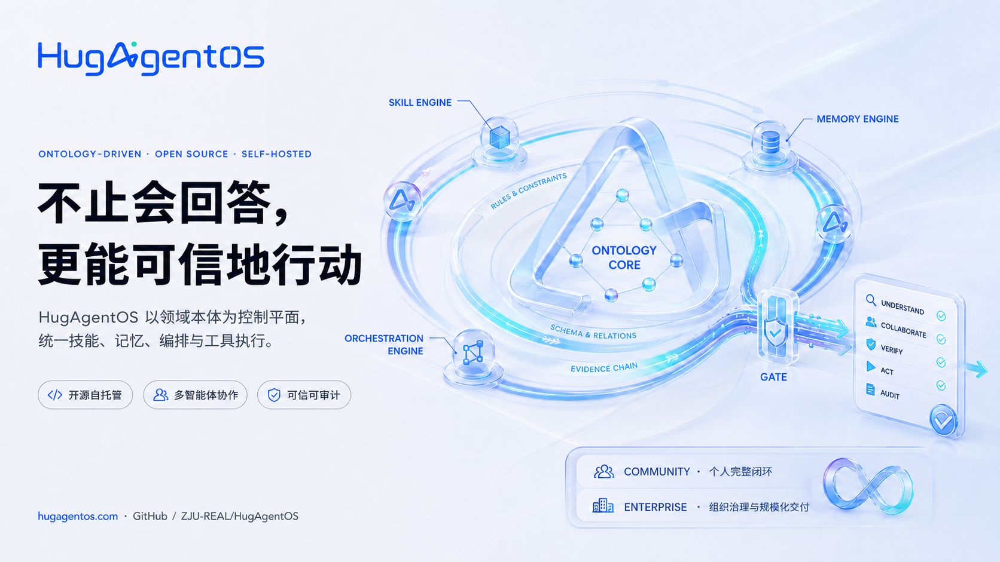
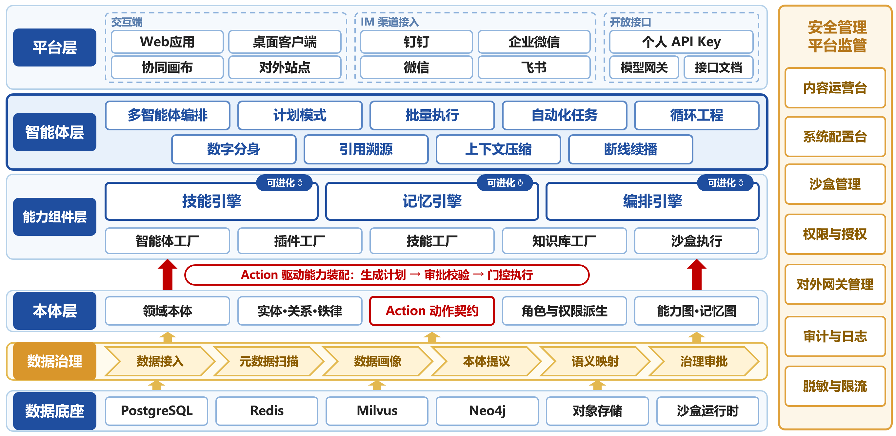

<p align="center">
  
</p>

<p align="center">
  <strong>HugAgentOS：面向企业的本体驱动可信推理 AgentOS</strong>
</p>

<p align="center">
  面向企业智能体的开源、自托管底座
</p>

<p align="center">
  让模型不只回答问题，还能检索知识、调用工具、处理文件、运行代码，
  并持续完成真实任务。
</p>

<p align="center">
  
</p>

<p align="center">
  <a href="./README.md">English</a> ·
  <a href="./README_CN.md">简体中文</a>
</p>

<!-- 预留稳定的上线地址，官网与在线体验启用后无需重新调整 README 结构。 -->
<p align="center">
  <a href="https://hugagentos.com">官方网站</a> ·
  <a href="https://app.hugagentos.com">在线使用</a>
</p>

<p align="center">
  <a href="./LICENSE">
    
  </a>
  <a href="./document/zh-CN/editions/overview.md">
    
  </a>
  <a href="./document/zh-CN/deployment/quick-install.md">
    
  </a>
  <a href="./document/zh-CN/architecture/overview.md">
    
  </a>
  <a href="./document/zh-CN/modules/mcp-tools.md">
    
  </a>
</p>

HugAgentOS 是面向企业级智能体场景的 AgentOS，把领域本体提升为推理、决策与
行动的控制平面。其开源社区版将智能对话、私有知识库 RAG、子智能体、MCP 工具、
Agent Skills、沙箱执行、长期记忆、自动化和数据画布整合到一个可私有部署的
工作空间中。

> [!NOTE]
> 本社区仓库由上游主仓按发布版本自动生成，并标记为 `generated`。
> `src/**` 的修改请通过 Issue 或 Discussion 反馈；文档与示例欢迎直接提交 PR。
> 详细规则见 [CONTRIBUTING.md](./CONTRIBUTING.md)。

## 演示

60 秒速览：同一个任务做两次——中间是受审计的自进化，记忆、技能与编排逐条沉淀，
每一步都要经你确认才生效。

https://github.com/user-attachments/assets/a268e371-a11f-488b-98d4-08598e2fdf89

## 快速开始

个人试用用一键安装，长期服务或需要服务隔离用 Docker Compose。两者都需要准备
OpenAI 兼容模型或本地模型。**初始账号与密码均为 `admin`，首次登录必须修改；
CE 不提供自助注册。**

### 方式一：一键安装（Linux / macOS / WSL2）

需要 Python 3.11+、Node.js 20+、Git 和 `curl`；不需要 Docker、PostgreSQL 或 Redis。

```bash
curl -fsSL https://raw.githubusercontent.com/ZJU-REAL/HugAgentOS/main/install.sh | bash
```

安装器会把源码拉到 `~/.hugagent/source`，创建隔离 Python 环境、构建 Web 应用并进入
首次配置向导，完成后打开 [http://127.0.0.1:3001](http://127.0.0.1:3001)。之后用
`~/.hugagent/venv/bin/hugagent` 再次启动。

> [!WARNING]
> 默认仅监听 `127.0.0.1`。确需远程访问时用
> `hugagent serve --host 0.0.0.0 --port 3001 --no-browser`，并先配置强密码、防火墙
> 与 HTTPS，不要直接暴露在不受信任的网络中。

一键安装使用 SQLite、进程内状态与本地子进程沙箱，适合个人试用与开发；选项与故障
排查见[一键安装指南](./document/zh-CN/deployment/quick-install.md)。

### 方式二：Docker Compose

需要 PostgreSQL、Redis、隔离沙箱与持久化卷时使用。需先安装 Git、Docker 与
Compose v2。

```bash
git clone https://github.com/ZJU-REAL/HugAgentOS.git
cd HugAgentOS
cp .env.example .env
mkdir -p data/storage
docker compose up -d --build
```

打开 [http://localhost:3002](http://localhost:3002)，登录后进入「设置 → 系统管理 →
模型服务」接入模型。Profiles、持久化与生产配置见
[Docker Compose 部署指南](./document/zh-CN/deployment/docker-compose.md)。

## 为什么是 HugAgentOS

重点不是再包装一个聊天界面，而是把智能体完成任务所需的上下文、执行能力和产物管理
放在同一条链路里；并把领域本体从「知识库」提升为**机器可执行的控制平面**——受控的
概念、关系、铁律与 Action 契约，让技能、记忆和编排三大引擎共享同一套业务语言。

<table>
  <tr>
    <td width="50%" valign="top">
      <strong>🔌 模型可替换</strong><br />
      统一的模型服务配置接入云端或本地模型，不锁定单一供应商。
    </td>
    <td width="50%" valign="top">
      <strong>🛠️ 能执行任务</strong><br />
      ReAct 编排 MCP、技能与沙箱，让模型能搜索、分析、生成文件并调用外部能力。
    </td>
  </tr>
  <tr>
    <td width="50%" valign="top">
      <strong>🧠 有知识与记忆</strong><br />
      私有知识库与分层记忆提供跨文件、跨会话的长期上下文。
    </td>
    <td width="50%" valign="top">
      <strong>🏠 数据可自持</strong><br />
      应用、数据库与文件存储都可运行在自己的基础设施中。
    </td>
  </tr>
  <tr>
    <td width="50%" valign="top">
      <strong>🛡️ 门控可信执行</strong><br />
      候选计划依次经过确定性规则检查、风险分级证据评审与门控执行；违规动作会带着
      规则、证据和修正建议返回，不会静默放行。
    </td>
    <td width="50%" valign="top">
      <strong>🔎 可溯的持续进化</strong><br />
      审批、驳回、证据与执行结果均留痕，整理为版本化本体建议，人工审核后生效并可回滚。
    </td>
  </tr>
</table>

> [!NOTE]
> 本体可信控制平面是正在现有 Harness 上分阶段集成的企业级目标架构。它强化结构化
> 合规和基于证据的评审，但不对自由文本作「零幻觉」承诺。

## 核心能力

社区版覆盖个人智能体从对话、执行到沉淀复用的完整闭环，可选组件按需启用。

| 能力 | 说明 |
|---|---|
| 💬 **智能对话与计划模式** | SSE 流式、ReAct 工具编排、深度思考、计划模式、引用溯源、断线续播 |
| 📚 **私有知识库 RAG** | 文档分块、向量与关键词混合检索、可选重排、个人知识库隔离 |
| 🤝 **个人子智能体** | 创建不同角色的子智能体，自动路由或 `@` 提及协同 |
| 🔧 **MCP 工具生态** | 内置联网搜索、网页抓取、知识检索、图表、报告、批量、自动化、技能管理 |
| 🧩 **Agent Skills** | 标准化技能说明 + 脚本扩展，支持内置、市场与个人技能 |
| ⚙️ **自动化与批量执行** | 自然语言创建定时任务；对 Excel / Word / 文件列表批量跑同一流程 |
| 💬 **群聊接入** | 飞书 / 钉钉 / 企微机器人；可选群聊旁听与历史回溯，让智能体看得到群里的上下文 |
| 🧪 **沙箱与产物** | 子进程或轻量容器沙箱执行代码，产出图表、报告、Office 文件、网页与数据画布 |
| 🧠 **三层个人记忆** | L1 画像存关系库；可选 Milvus 向量记忆与 Neo4j 图谱记忆 |
| 🧬 **个人进化** | 从你的真实工作沉淀记忆与技能，逐条审批后才对你生效，可随时关闭 |
| 🗂️ **个人工作空间** | 项目、文件夹、收藏、会话分享与产物中心 |
| 📊 **数据画布** | 会话内查看与编辑结构化数据，分析过程与结果同处一个工作区 |

## 系统架构

HugAgentOS 将用户渠道、智能体工作流、可复用能力引擎、本体契约、数据治理和
基础设施分层组织。Action 契约把本体层与计划生成、审批校验和门控执行连接起来，
安全管理与平台监管则贯穿完整技术栈。



> [!NOTE]
> 架构图展示 HugAgentOS 的完整产品架构。其中部分治理、协作、网关和持久沙箱
> 能力仅在商业版中提供。

### 技术栈

项目选择成熟、可替换的开源组件，并通过清晰的服务边界组合为完整产品。

| 层级 | 主要技术 |
|---|---|
| 智能体运行时 | AgentScope 2.0、ReAct、Model Context Protocol |
| 后端 | Python、FastAPI、SQLAlchemy、Alembic |
| 前端 | React 19、TypeScript、Vite、Zustand、Ant Design |
| 数据与状态 | SQLite 或 PostgreSQL 15、进程内状态或 Redis 7、本地文件存储 |
| 可选记忆 | Milvus 2.4、Neo4j 5 Community、mem0 |
| 部署 | 本地一键安装、Docker Compose、Nginx |

更详细的请求生命周期、容器拓扑和关键设计决策见
[架构总览](./document/zh-CN/architecture/overview.md)。

## 社区版与商业版

社区版让个人把智能体能力完整运行起来；商业版在相同产品体验上补充组织级治理、
协作和交付能力。商业版能力不会以关闭开关的形式混入社区版源码。

| 社区版（CE） | 商业版（EE）新增 |
|---|---|
| 智能对话、计划模式与个人子智能体 | 团队、成员、组织级智能体库与权限矩阵 |
| 7 个通用 MCP、个人技能与技能市场 | 行业数据工具、组织级能力治理与技能审核 |
| 私有知识库、三层个人记忆 | 公共知识库管理与记忆审计 |
| 自动化、批量执行、个人数据画布 | 组织计费、用量汇总与画布多人协同 |
| 轻量沙箱、本地文件存储 | 持久沙箱、云存储与离线商业交付 |
| 本地账号与保留 Powered-by 的品牌配置 | SSO、审计合规与完整 white-label |

功能边界与升级路径以
[社区版与商业版说明](./document/zh-CN/editions/overview.md)为准。

## 文档

仓库内提供完整的中英文文档，从首次部署到架构和二次开发均可离线阅读。

| 你想了解 | 中文文档 | English |
|---|---|---|
| 项目定位与整体能力 | [产品简介](./document/zh-CN/getting-started/introduction.md) | [Introduction](./document/en/getting-started/introduction.md) |
| 10 分钟运行项目 | [快速开始](./document/zh-CN/getting-started/quick-start.md) | [Quick start](./document/en/getting-started/quick-start.md) |
| 生产部署与环境变量 | [部署指南](./document/zh-CN/deployment/README.md) | [Deployment](./document/en/deployment/README.md) |
| 系统设计与请求链路 | [架构总览](./document/zh-CN/architecture/overview.md) | [Architecture](./document/en/architecture/overview.md) |
| 快速构建领域本体 | [领域本体快速入门](./document/zh-CN/getting-started/domain-ontology-quickstart.md) | [Domain ontology quickstart](./document/en/getting-started/domain-ontology-quickstart.md) |
| MCP、技能、记忆与沙箱 | [功能模块](./document/zh-CN/README.md#功能模块) | [Modules](./document/en/README.md#modules) |
| 后端与前端开发 | [开发指南](./document/zh-CN/README.md#开发指南) | [Development](./document/en/README.md#development) |

所有文档入口见 [document/README.md](./document/README.md)。

## 路线图

1. **云端 / 本地无缝切换与多端互通** —— 一套服务端连接多客户端，同步会话、智能体、
   技能、文件与任务状态。
2. **基于 MoA 的自适应模型路由** —— 按任务复杂度、模态、时延与成本选择或组合模型，
   简单任务用轻量模型，复杂任务再升级。
3. **更丰富的扩展生态** —— 持续扩充智能体、技能、MCP 服务与插件，完善发现、安装、
   更新与质量/安全审核流程。

## 参与贡献

我们欢迎问题反馈、功能建议、文档改进和可复现的补丁。提交前请先阅读
[贡献指南](./CONTRIBUTING.md)，了解生成代码与可直接修改内容的边界。

- 报告 Bug 时，请附复现步骤、期望行为、实际行为和运行环境。
- 提议功能时，请说明具体使用场景，以及它解决了什么问题。
- 修改文档或示例时，请保持中英文内容与 CE/EE 边界一致。

发现安全漏洞时不要创建公开 Issue。请按照
[安全策略](./SECURITY.md)提供的私密渠道报告。

## 许可证

HugAgentOS Community Edition 采用 Apache License 2.0 并附加补充条款。
补充条款限制将本软件作为竞争性的多租户 SaaS 转售，并要求保留界面中的
Powered-by 标识。内部使用、修改和分发的完整权利与义务以
[LICENSE](./LICENSE)和 [NOTICE](./NOTICE)为准。
