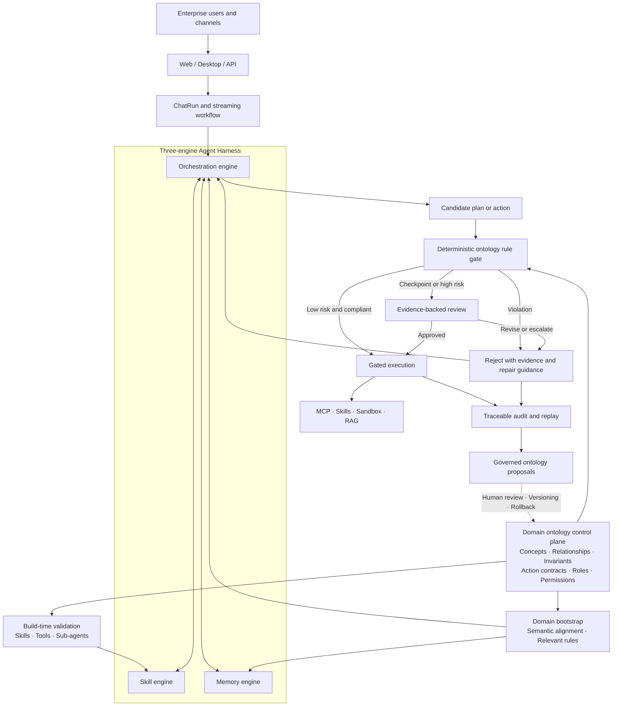

# Architecture Overview

> Last updated: 2026-07-19

HugAgentOS is an enterprise-grade AgentOS with both a lightweight local profile and a fully containerized production profile. A React single-page application provides the user experience, an async FastAPI service runs the backend, AgentScope 2.0's ReActAgent supplies the agent runtime, independent MCP (Model Context Protocol) processes expose tools, and pluggable sandbox providers isolate code execution. The platform ships in two editions — an open-source Community Edition (CE) and a commercial Enterprise Edition (EE) — built from a single codebase and separated by three runtime seams: the router registry, the table-creation boundary, and license feature gates (see [Editions](../editions/overview.md)).

This page describes the system from five angles: the layered architecture, the ontology-grounded enterprise trust plane, the full lifecycle of one chat request, the container topology, and the key design decisions. For deeper dives, see [Backend Architecture](./backend.md), [Frontend Architecture](./frontend.md), and the [Data Model](./data-model.md).

## Technology Stack

| Layer | Technology |
|---|---|
| Frontend | React 19 + TypeScript + Vite + Ant Design + Zustand |
| Edge | Nginx (serves static assets, reverse-proxies `/api` to the backend) |
| Backend | Python + FastAPI + SQLAlchemy + Alembic |
| Agent runtime | AgentScope 2.0 (ReActAgent + Toolkit + middlewares) |
| Tool protocol | MCP (streamable-http, long-running processes in a dedicated `mcp` container) |
| Sandbox | OpenSandbox / CubeSandbox (Enterprise Edition, EE), script-runner lightweight sandbox |
| Data | PostgreSQL (production) / SQLite (dev), Redis, Milvus + Neo4j (optional memory components) |
| Storage | Local disk / S3 / Aliyun OSS (cloud storage is Enterprise Edition, EE) |

## Layered Architecture

```
┌────────────────────────────────────────────────────────────────────┐
│  Browser (React SPA)                                               │
│  App.tsx main app · AdminApp content console (EE)                  │
│  ConfigApp system console (EE)                                     │
│  api.ts typed client + useStreaming SSE parser                     │
└──────────────────────────────┬─────────────────────────────────────┘
                               │ HTTP / SSE (under /api)
┌──────────────────────────────▼─────────────────────────────────────┐
│  Nginx (frontend container, :80)                                   │
│  Static assets · /api → backend reverse proxy                      │
└──────────────────────────────┬─────────────────────────────────────┘
                               │
┌──────────────────────────────▼─────────────────────────────────────┐
│  FastAPI (backend container, src/backend/api/)                     │
│  Middleware: CORS · structured logging · unified error handling    │
│  Router registry: CE_ROUTERS + EE_ROUTERS (license feature gates)  │
└──────────────────────────────┬─────────────────────────────────────┘
                               │
┌──────────────────────────────▼─────────────────────────────────────┐
│  Orchestration layer (src/backend/orchestration/)                  │
│  chat_run_executor: decouples Runs from HTTP, resumable streams    │
│  workflow: streaming orchestration · strategy: routing             │
│  citations: reference extraction · memory_integration              │
│  subagents/plan_mode · schedulers: automation + distillation (EE)  │
└──────────────────────────────┬─────────────────────────────────────┘
                               │
┌──────────────────────────────▼─────────────────────────────────────┐
│  Agent layer (src/backend/core/llm/)                               │
│  agent_factory → AgentScope 2.0 ReActAgent                         │
│  ToolCollector → Toolkit (built-in tools + skills + MCP tools)     │
│  middlewares: dynamic model / file context / system reminders      │
│  offloader: oversized tool results spilled to sandbox              │
│  prompts/prompt_runtime: system prompt assembly (DB-first)         │
└───────┬──────────────────────┬──────────────────────┬──────────────┘
        │ streamable-http      │ sandbox protocol      │ SQL / vectors
┌───────▼───────────┐ ┌────────▼──────────┐ ┌─────────▼─────────────┐
│ MCP tool pool      │ │ Sandboxes         │ │ Data layer            │
│ mcp container,     │ │ script-runner(CE) │ │ PostgreSQL · Redis    │
│ 8 servers          │ │ OpenSandbox (EE)  │ │ Milvus · Neo4j (opt.) │
│ :9100–:9107        │ │ CubeSandbox (EE)  │ │ Local / S3 / OSS      │
│ search/fetch/chart │ │                   │ │ storage               │
│ export/dwh/chain(EE)│ │                  │ │                       │
└───────────────────┘ └───────────────────┘ └───────────────────────┘
```

Dependencies point strictly downward: `api → orchestration → core`, and within `core`, `services → db`. MCP servers are independent processes that talk to the backend exclusively over HTTP, so a crash on either side never takes down the other.

## Ontology-Grounded Enterprise Trust Plane

HugAgentOS extends the runtime into a trustworthy enterprise AgentOS by treating
domain ontology as an executable control plane rather than only a knowledge
store. A versioned Domain Pack can progress from controlled concepts and
relationships to invariants, Action contracts, workflows, roles, permissions,
and evidence requirements. The skill, orchestration, and memory engines
therefore reason against the same business semantics.

The diagram below is the target enterprise architecture being integrated
incrementally on top of the current Harness. Existing confirmation gates,
structured review verdicts, audit records, and versioning provide the base;
ontology-specific assets and enforcement are added without claiming that every
free-text hallucination can be eliminated.



Three principles keep the trust plane useful without turning every step into
an expensive committee review:

1. **Deterministic before probabilistic.** Machine-checkable invariants,
   permissions, and Action contracts run first.
2. **Review according to risk.** Only checkpoints, high-risk actions, or
   uncertain evidence invoke deeper review; compliant low-risk actions proceed
   through the execution gate.
3. **Evidence before evolution.** Violations, approvals, and outcomes enter the
   audit trail. Proposed ontology changes require human approval, a new
   version, and a rollback path.

Ontology and RAG remain complementary: ontology governs what an agent may do
and which constraints apply, while RAG supplies the documents and evidence
used to support a decision.

## Lifecycle of a Chat Request

The entry point is `POST /v1/chats/stream` (`src/backend/api/routes/v1/chats.py`), which returns `text/event-stream`.

### 1. Ingress and validation

1. Nginx forwards `/api/v1/chats/stream` to the backend.
2. `api/deps.py::get_current_user` resolves the session cookie or a personal API key; with neither, the request gets a 401.
3. Three read-only queries (capability resolution, user settings, session history) run in parallel via `asyncio.to_thread`, each with its own DB session.
4. The route validates sub-agent ownership and project mount permissions, persists the user message, and assembles the workflow context (`core/chat/context.py`).

### 2. Starting a Run (decoupled from HTTP)

`orchestration/chat_run_executor.py::start_run` registers the AI workflow as a background Run (persisted to the `chat_runs` table); the HTTP response merely *follows* that Run:

- After a dropped connection or page refresh, the client calls `GET /v1/chats/stream/{run_id}` to resume from a given offset;
- On backend restart, the lifespan hook `_startup_recover_chat_runs` recovers or reaps unfinished Runs.

### 3. Orchestration and agent execution

`orchestration/workflow.py::astream_chat_workflow` drives a single turn:

1. **Memory retrieval** — `orchestration/memory_integration.py` reads the L1 profile / L2 vector memories (when enabled) and injects them as a system message;
2. **Routing decision** — `orchestration/strategy.py`; `ROUTER_STRATEGY=main_only` (default) always routes to the main agent;
3. **Agent construction** — `core/llm/agent_factory.py::create_agent_executor`: assembles the prompt (`prompts/prompt_runtime.py`, DB version pool first), filters MCP servers by catalog and per-user capabilities, registers built-in tools (Read/Write/Edit/Glob/Grep/bash/skill loading, see `core/llm/tools/`), then constructs the AgentScope Toolkit in one shot;
4. **Streaming execution** — `orchestration/streaming.py::StreamingAgent` wraps the ReActAgent and yields reasoning deltas, tool calls, and tool results as they happen;
5. **Citation extraction** — `orchestration/citations.py` parses `[ref:tool_name-N]` markers out of tool results into citation items;
6. **Wrap-up** — the assistant message and tool-call logs are persisted, `core/memory/pipeline.py` extracts memories asynchronously in the background (off the SSE hot path), and follow-up questions are generated by a separate endpoint (`orchestration/followups.py`).

### 4. The SSE event stream

Each event is `data: {json}\n\n` with a `type` discriminator; the stream terminates with `data: [DONE]`:

| Event `type` | Meaning | Produced by |
|---|---|---|
| `content` (`event: ai_message`) | Body text delta | `chats.py::_stream_sse_response` |
| `thinking` | Extended-thinking delta | `core/chat/tool_log.py::build_thinking_event` |
| `tool_call` | Tool invocation started (name + args) | `core/chat/tool_log.py` |
| `tool_result` | Tool execution result (with citations, artifact card payloads) | `core/chat/tool_log.py` + `orchestration/tool_payloads.py` |
| `tool_progress` | Progress reports from long-running tools | `chats.py` |
| `batch_confirm` / `file_confirm` | Batch-execution confirmation; MySpace write confirmation (hard-pause gate) | `chats.py` |
| `meta` | Trailing metadata: route, citation sources, artifact list, etc. | `orchestration/workflow.py` |
| `error` | Error event (immediately followed by `[DONE]`) | `chats.py` |

The frontend's `src/frontend/src/hooks/useStreaming.ts` dispatches on `type` and renders text, the tool timeline, and citations incrementally into the message bubble.

## Container Topology

`docker-compose.yml` defines every service, grouped by profile:

| Service | Container | Ports | Notes |
|---|---|---|---|
| `frontend` | hugagent-frontend | `3002:80` | Nginx: static assets + `/api` reverse proxy |
| `backend` | hugagent-backend | `3001` | FastAPI main service |
| `mcp` | hugagent-mcp | internal `9100–9108`, `9112` | 10 MCP servers as long-running streamable-http processes (8 general CE tools plus 2 EE industry tools) |
| `postgres` | hugagent-postgres | `5432` | Primary database |
| `redis` | hugagent-redis | `6379` | Sessions / caching |
| `script-runner` (profile `script_runner`) | hugagent-script-runner | internal | Lightweight script-execution sidecar (no DB/secret access) |
| `opensandbox` + `opensandbox-config-init` (profile `opensandbox`) | hugagent-opensandbox | internal | Persistent sandbox (Enterprise Edition, EE) |
| `etcd` / `minio` / `milvus` (profile `mem0`) | hugagent-etcd etc. | internal | L2 vector-memory infrastructure |
| `neo4j` (profile `mem0`) | hugagent-neo4j | `7474/7687` | L3 graph memory (optional) |

All services share the `hugagent-network` network; named volumes such as `postgres_data` persist across rebuilds. See [Docker Compose deployment](../deployment/docker-compose.md) for details.

## Key Design Decisions

### Catalog as the single source of truth

`src/backend/core/config/catalog.json` is the sole authority for capability switches, with four kinds of entries: `skills` / `agents` / `mcp` / `kb`. `core/config/catalog.py` exposes `is_enabled(kind, id)` / `get_enabled_ids(kind)`, gating everything from MCP tool loading and skill registration to routing decisions; admin toggles are stored as overrides in the `catalog_overrides` table layered on top of the file (`core/config/catalog_loader.py`). Adding a capability to the catalog makes it visible to both the frontend capability center and the agent factory — no orchestration changes required. See [Capability Catalog](../modules/catalog.md).

### Unified response envelope

Every v1 endpoint returns `{ code, message, data, trace_id, timestamp }`, produced exclusively by `success_response` / `error_response` / `paginated_response` in `core/infra/responses.py`; SSE endpoints are uniformly wrapped by `sse_response` (which sets the standard proxy-buffering-disabled headers). The frontend's `api.ts::unwrapData` unwraps the envelope; the error-code scheme is documented in [Error Codes](../api/error-codes.md).

### Prompts live in the database

System prompts are no longer hardcoded: the version pool is stored in the `content_blocks` table (`id=prompt_versions`), managed by `core/services/prompt_version_service.py` (CRUD, activation, first-boot seeding). At assembly time, `prompts/prompt_runtime.py` degrades through three levels — active DB version → file fallback under `prompts/prompt_text/default/system/` → a minimal hardcoded fallback — guaranteeing a non-empty prompt. Operators can canary-switch prompt versions from the admin console without a release. See [Prompt System](../modules/prompts.md).

### MCP tools as independent processes

Each tool is a standalone MCP server under `src/backend/mcp_servers/<name>/`, all running inside the dedicated `mcp` container as long-lived streamable-http listeners (the port table in `mcp_servers/_ports.py` is the single source of truth). The backend connects through the HTTP client pool in `core/llm/mcp_manager.py`. Benefits: a tool crash never affects the main process, heavy office dependencies have moved out of the mcp image, and the tool tier can scale independently. CE keeps 8 general-purpose servers; the two industry tools, `query_database` and `ai_chain_information_mcp`, depend on intranet data sources and belong to the Enterprise Edition (EE). See [MCP Tools](../modules/mcp-tools.md).

### Runs decoupled from connections

Streaming chats are not tied to the HTTP connection lifecycle: `chat_run_executor` persists execution state to the `chat_runs` table and supports offset-based resumption — eliminating "refresh loses the reply" and flaky-network drops — and the same execution channel is reused by the automation scheduler.

### One codebase, two editions

The commercial main repository carries the full code; the Community Edition is derived by `scripts/build_ce.py` according to `ce/manifest.yaml` (exclude EE files + brand-neutralizing text transforms + overlay). Three runtime seams: the router registry `api/routes/v1/__init__.py` (EE routers carry license feature bits), the table-creation boundary `core/db/edition_tables.py` (CE skips 18 EE-only tables), and the license facade `core/licensing/manager.py` (all feature bits are hard-`False` under CE). See [Editions](../editions/overview.md).

## Related Source

| Topic | Path |
|---|---|
| FastAPI app and startup hooks | `src/backend/api/app.py` |
| Streaming chat entry point | `src/backend/api/routes/v1/chats.py` |
| Run executor | `src/backend/orchestration/chat_run_executor.py` |
| Streaming orchestration | `src/backend/orchestration/workflow.py` |
| Agent factory | `src/backend/core/llm/agent_factory.py` |
| MCP config and ports | `src/backend/core/config/mcp_config.py`, `src/backend/mcp_servers/_ports.py` |
| Capability catalog | `src/backend/core/config/catalog.json`, `catalog.py` |
| Response envelope | `src/backend/core/infra/responses.py` |
| Prompt assembly | `src/backend/prompts/prompt_runtime.py` |
| CE/EE seams | `src/backend/api/routes/v1/__init__.py`, `src/backend/core/db/edition_tables.py`, `src/backend/core/licensing/` |
| Container orchestration | `docker-compose.yml` |
