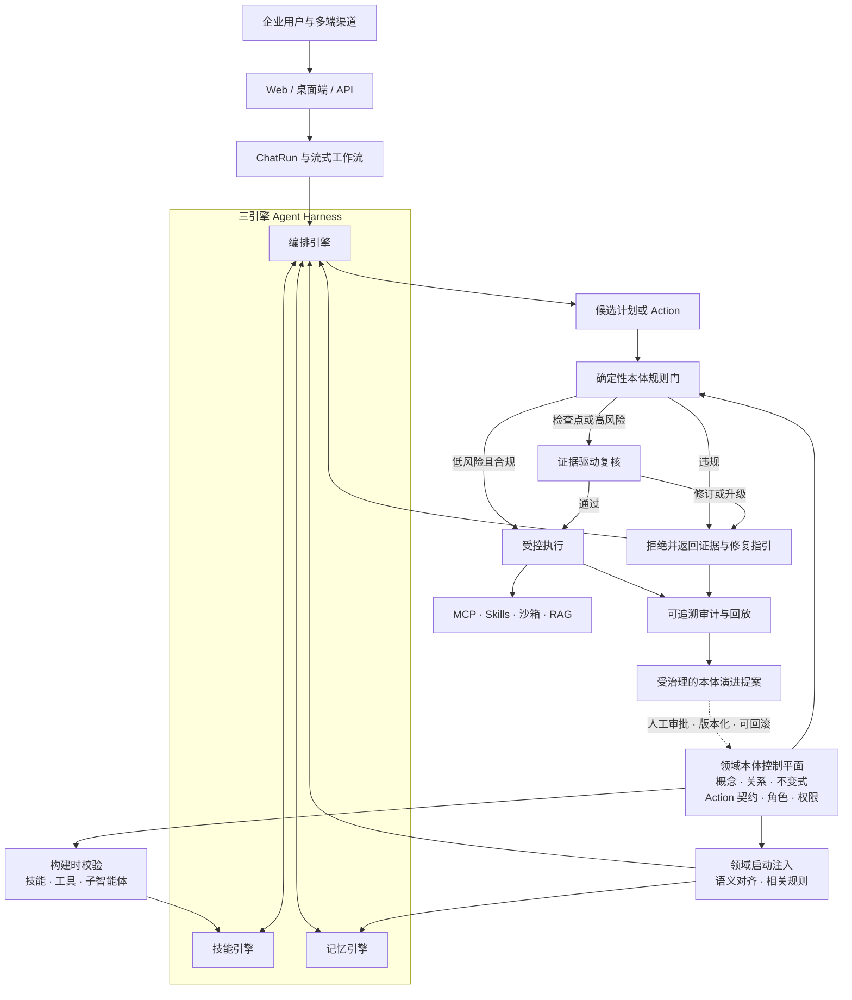

# 系统整体架构

> 最后更新：2026-07-19

HugAgentOS 是一个面向企业的 AgentOS，同时提供轻量本地运行形态和全容器化生产形态。前端为 React 单页应用，后端为 FastAPI 异步服务，智能体底座为 AgentScope 2.0 的 ReActAgent，工具生态通过 MCP（Model Context Protocol）以独立进程提供，代码执行落在可插拔的沙箱驱动上。平台以「开源社区版（CE）+ 商业版（EE）」双形态发行，两版共用一套代码，通过路由注册表、建表边界与 license 能力位三道接缝裁剪（详见 [版本与授权](../editions/overview.md)）。

本文从五个视角描述系统：分层架构、本体驱动的企业可信控制平面、一次对话请求的完整生命周期、容器拓扑、关键设计决策。更深入的模块拆解见 [后端架构](./backend.md)、[前端架构](./frontend.md) 与 [数据模型](./data-model.md)。

## 技术栈一览

| 层 | 技术选型 |
|---|---|
| 前端 | React 19 + TypeScript + Vite + Ant Design + Zustand |
| 接入 | Nginx（托管静态资源，`/api` 反向代理到后端） |
| 后端 | Python + FastAPI + SQLAlchemy + Alembic |
| 智能体 | AgentScope 2.0（ReActAgent + Toolkit + 中间件） |
| 工具协议 | MCP（streamable-http，独立 `mcp` 容器常驻进程） |
| 沙箱 | OpenSandbox / CubeSandbox（商业版 EE）、script-runner 轻量沙箱 |
| 数据 | PostgreSQL（生产）/ SQLite（开发）、Redis、Milvus + Neo4j（可选记忆组件） |
| 存储 | 本地磁盘 / S3 / 阿里云 OSS（云存储为商业版 EE） |

## 分层架构图

```
┌────────────────────────────────────────────────────────────────────┐
│  浏览器（React SPA）                                                │
│  App.tsx 主应用 · AdminApp 内容台(EE) · ConfigApp 系统台(EE)        │
│  api.ts 类型化客户端 + useStreaming SSE 解析                        │
└──────────────────────────────┬─────────────────────────────────────┘
                               │ HTTP / SSE（/api 前缀）
┌──────────────────────────────▼─────────────────────────────────────┐
│  Nginx（frontend 容器，:80）                                        │
│  静态资源托管 · /api → backend 反向代理                             │
└──────────────────────────────┬─────────────────────────────────────┘
                               │
┌──────────────────────────────▼─────────────────────────────────────┐
│  FastAPI（backend 容器，src/backend/api/）                          │
│  中间件：CORS · 结构化日志 · 统一错误处理                            │
│  路由注册表：CE_ROUTERS + EE_ROUTERS（license 能力位守卫）           │
└──────────────────────────────┬─────────────────────────────────────┘
                               │
┌──────────────────────────────▼─────────────────────────────────────┐
│  编排层（src/backend/orchestration/）                               │
│  chat_run_executor：Run 与 HTTP 连接解耦、断线续播                   │
│  workflow：流式编排 · strategy：路由策略 · citations：引用提取        │
│  memory_integration：记忆读写 · subagents/plan_mode：计划模式        │
│  schedulers：自动化定时任务 · 技能蒸馏 cron（EE）                    │
└──────────────────────────────┬─────────────────────────────────────┘
                               │
┌──────────────────────────────▼─────────────────────────────────────┐
│  智能体层（src/backend/core/llm/）                                  │
│  agent_factory → AgentScope 2.0 ReActAgent                          │
│  ToolCollector → Toolkit（自研工具 + 技能 + MCP 工具）               │
│  middlewares：动态模型/文件上下文/系统提醒 · offloader：超长结果落盘  │
│  prompts/prompt_runtime：系统提示词装配（DB 优先，文件兜底）          │
└───────┬──────────────────────┬──────────────────────┬──────────────┘
        │ streamable-http      │ 沙箱驱动协议           │ SQL / 向量
┌───────▼───────────┐ ┌────────▼──────────┐ ┌─────────▼─────────────┐
│ MCP 工具池         │ │ 沙箱               │ │ 数据层                 │
│ mcp 容器 8 个服务   │ │ script-runner(CE) │ │ PostgreSQL · Redis    │
│ :9100–:9107 常驻   │ │ OpenSandbox(EE)   │ │ Milvus · Neo4j(可选)  │
│ 搜索/抓取/图表/导出 │ │ CubeSandbox(EE)   │ │ 本地 / S3 / OSS 存储   │
│ 数仓/产业链(EE)    │ │                   │ │                       │
└───────────────────┘ └───────────────────┘ └───────────────────────┘
```

依赖方向自上而下单向：`api → orchestration → core`，`core` 内部 `services → db`。MCP 服务器是独立进程，与后端只通过 HTTP 通信，崩溃互不影响。

## 领域本体驱动的企业可信控制平面

HugAgentOS 将领域本体作为可执行的控制平面，而不只是一个知识库，
从而把智能体运行时扩展为面向企业的可信 AgentOS。版本化的领域包
（Domain Pack）可从受控概念和关系，逐步延伸到不变式、Action 契约、
工作流、角色、权限和证据要求，让技能、编排和记忆三个引擎使用同一套
业务语义。

下图是在当前 Harness 基础上渐进集成的目标企业架构。现有的确认门、
结构化审查结论、审计记录与版本管理构成底座，本体资产和执行约束则逐步
接入；这一机制用于增强合规与证据驱动审查，不宣称能消除所有自由文本幻觉。



可信控制平面遵循三项原则，避免把每一步都变成高成本的委员会审查：

1. **确定性优先。** 先执行可机械判定的不变式、权限和 Action 契约。
2. **按风险复核。** 仅检查点、高风险动作或证据不确定时进入深度复核；
   合规的低风险动作可直接通过执行门。
3. **有证据再演进。** 违规、审批和执行结果进入审计链；本体变更提案必须经过
   人工批准、生成新版本并保留回滚路径。

本体与 RAG 相互补充：本体规定智能体可以做什么、需要满足哪些约束，
RAG 则提供支撑决策所需的文档与证据。

## 一次对话请求的完整生命周期

入口为 `POST /v1/chats/stream`（`src/backend/api/routes/v1/chats.py`），返回 `text/event-stream`。

### 1. 接入与校验

1. Nginx 把 `/api/v1/chats/stream` 转发到 backend。
2. `api/deps.py::get_current_user` 解析 session cookie 或个人 API-Key，二者皆无返回 401。
3. 三个只读查询（能力位解析、用户设置、会话历史）通过 `asyncio.to_thread` 并行执行，各自持独立 DB 会话。
4. 校验子智能体归属、项目挂载权限，落库用户消息，组装 workflow context（`core/chat/context.py`）。

### 2. 启动 Run（与 HTTP 连接解耦）

`orchestration/chat_run_executor.py::start_run` 把 AI 工作流注册为后台 Run（落 `chat_runs` 表），HTTP 响应只是「跟随」这个 Run：

- 浏览器断线、刷新页面后可调 `GET /v1/chats/stream/{run_id}` 从指定偏移续播；
- 后端重启时 lifespan 钩子 `_startup_recover_chat_runs` 恢复/收割未完成的 Run。

### 3. 编排与智能体执行

`orchestration/workflow.py::astream_chat_workflow` 驱动单轮执行：

1. **记忆检索**——`orchestration/memory_integration.py` 读取 L1 画像 / L2 向量记忆（开启时），注入系统消息；
2. **路由决策**——`orchestration/strategy.py`，`ROUTER_STRATEGY=main_only`（默认）恒路由到主智能体；
3. **构建智能体**——`core/llm/agent_factory.py::create_agent_executor`：装配提示词（`prompts/prompt_runtime.py`，DB 版本池优先）、按 catalog 与用户能力位筛选 MCP 服务器、注册自研工具（Read/Write/Edit/Glob/Grep/bash/技能加载等，见 `core/llm/tools/`）、最终一次性构造 AgentScope Toolkit；
4. **流式执行**——`orchestration/streaming.py::StreamingAgent` 包装 ReActAgent，把推理增量、工具调用、工具结果逐条产出；
5. **引用提取**——`orchestration/citations.py` 从工具结果中解析 `[ref:tool_name-N]` 标记生成引用项；
6. **收尾**——落库助手消息与工具调用日志，`core/memory/pipeline.py` 在后台异步抽取记忆（不阻塞 SSE 主链路），独立接口生成追问问题（`orchestration/followups.py`）。

### 4. SSE 事件流

每条事件为 `data: {json}\n\n`，`type` 字段区分种类，流末尾以 `data: [DONE]` 终止：

| 事件 `type` | 含义 | 产出处 |
|---|---|---|
| `content`（`event: ai_message`） | 正文文本增量 | `chats.py::_stream_sse_response` |
| `thinking` | 深度思考增量 | `core/chat/tool_log.py::build_thinking_event` |
| `tool_call` | 工具调用开始（名称 + 参数） | `core/chat/tool_log.py` |
| `tool_result` | 工具执行结果（含引用、产物卡片载荷） | `core/chat/tool_log.py` + `orchestration/tool_payloads.py` |
| `tool_progress` | 长工具的进度上报 | `chats.py` |
| `batch_confirm` / `file_confirm` | 批量执行确认、「我的空间」写操作确认（真挂起门控） | `chats.py` |
| `meta` | 末尾元信息：路由、引用源、产物列表等 | `orchestration/workflow.py` |
| `error` | 错误事件（随后立即 `[DONE]`） | `chats.py` |

前端 `src/frontend/src/hooks/useStreaming.ts` 按 `type` 分发，把文本、工具时间线、引用增量渲染进消息气泡。

## 容器拓扑

`docker-compose.yml` 定义全部服务，按 profile 分组：

| 服务 | 容器名 | 端口 | 说明 |
|---|---|---|---|
| `frontend` | hugagent-frontend | `3002:80` | Nginx：静态资源 + `/api` 反代 |
| `backend` | hugagent-backend | `3001` | FastAPI 主服务 |
| `mcp` | hugagent-mcp | 内部 `9100–9108`、`9112` | 10 个 MCP 服务器常驻进程（streamable-http；CE 8 个通用工具，EE 另含 2 个行业工具） |
| `postgres` | hugagent-postgres | `5432` | 主数据库 |
| `redis` | hugagent-redis | `6379` | 会话 / 缓存 |
| `script-runner`（profile `script_runner`） | hugagent-script-runner | 内部 | 轻量脚本执行 sidecar（无 DB/密钥访问权） |
| `opensandbox` + `opensandbox-config-init`（profile `opensandbox`） | hugagent-opensandbox | 内部 | 持久沙箱（商业版 EE） |
| `etcd` / `minio` / `milvus`（profile `mem0`） | hugagent-etcd 等 | 内部 | L2 向量记忆基础设施 |
| `neo4j`（profile `mem0`） | hugagent-neo4j | `7474/7687` | L3 图谱记忆（可选） |

所有服务挂在同一 `hugagent-network` 网络；`postgres_data` 等具名卷跨重建持久化。部署细节见 [Docker Compose 部署](../deployment/docker-compose.md)。

## 关键设计决策

### Catalog 单一真源

`src/backend/core/config/catalog.json` 是能力开关的唯一权威，四类条目：`skills` / `agents` / `mcp` / `kb`。`core/config/catalog.py` 暴露 `is_enabled(kind, id)` / `get_enabled_ids(kind)`，从 MCP 工具装载、技能注册到路由决策全部经此门控；管理台的启停操作写 `catalog_overrides` 表叠加在文件之上（`core/config/catalog_loader.py`）。新能力只要进 catalog 即可被前端能力中心与智能体工厂同时感知，无需改编排代码。详见 [能力目录](../modules/catalog.md)。

### 统一响应信封

全部 v1 接口返回 `{ code, message, data, trace_id, timestamp }`，由 `core/infra/responses.py` 的 `success_response` / `error_response` / `paginated_response` 统一生产；SSE 端点统一经 `sse_response` 包装（携带禁用代理缓冲的标准头）。前端 `api.ts::unwrapData` 对应解包，错误码体系见 [错误码](../api/error-codes.md)。

### 提示词 DB 化

系统提示词不再硬编码：版本池存于 `content_blocks` 表（`id=prompt_versions`），由 `core/services/prompt_version_service.py` 管理 CRUD、激活与首启 seed；`prompts/prompt_runtime.py` 装配时按「DB 激活版本 → `prompts/prompt_text/default/system/` 文件兜底 → 最小硬编码兜底」三级降级，保证永不为空。运营可在管理台灰度切换提示词版本而无需发版。详见 [提示词系统](../modules/prompts.md)。

### MCP 工具独立进程

每个工具是 `src/backend/mcp_servers/<name>/` 下的独立 MCP 服务器，统一运行在专用 `mcp` 容器内，以 streamable-http 常驻监听（端口表 `mcp_servers/_ports.py` 为单一真源），后端经 `core/llm/mcp_manager.py` 的 HTTP 客户端连接池复用连接。好处：工具崩溃不影响主进程、依赖隔离（办公三件套的 LibreOffice 等重依赖已迁出 mcp 镜像）、可独立扩缩。CE 保留 8 个通用 Server；`query_database` 与 `ai_chain_information_mcp` 两个行业工具依赖内网数据源，归商业版 EE。详见 [MCP 工具](../modules/mcp-tools.md)。

### Run 与连接解耦

流式对话不绑定 HTTP 连接生命周期：`chat_run_executor` 把执行状态写入 `chat_runs` 表并支持按偏移续播，彻底解决「刷新页面丢回复」「弱网断流」问题，也让自动化调度器能复用同一执行通道。

### CE/EE 同源双形态

商业版主仓即全量代码；社区版由 `scripts/build_ce.py` 按 `ce/manifest.yaml` 派生（排除 `edition_ee` 实现 + 文本变换 + CE overlay）。运行时边界包括路由注册表 `api/routes/v1/__init__.py`、建表边界 `core/db/edition_tables.py`（CE 不注册 20 张 EE 专属表）、EE 的 `edition_ee/licensing/` 与 CE 固定版本中间件，以及站点可见性等版本策略缝隙。详见 [版本与授权](../editions/overview.md)。

## 相关源码

| 主题 | 路径 |
|---|---|
| FastAPI 应用与启动钩子 | `src/backend/api/app.py` |
| 流式对话入口 | `src/backend/api/routes/v1/chats.py` |
| Run 执行器 | `src/backend/orchestration/chat_run_executor.py` |
| 流式编排 | `src/backend/orchestration/workflow.py` |
| 智能体工厂 | `src/backend/core/llm/agent_factory.py` |
| MCP 配置与端口 | `src/backend/core/config/mcp_config.py`、`src/backend/mcp_servers/_ports.py` |
| 能力目录 | `src/backend/core/config/catalog.json`、`catalog.py` |
| 响应信封 | `src/backend/core/infra/responses.py` |
| 提示词装配 | `src/backend/prompts/prompt_runtime.py` |
| CE/EE 接缝 | `src/backend/api/routes/v1/__init__.py`、`src/backend/core/db/edition_tables.py`、`src/backend/api/middleware/edition.py`、`src/backend/edition_ee/licensing/` |
| 容器编排 | `docker-compose.yml` |
