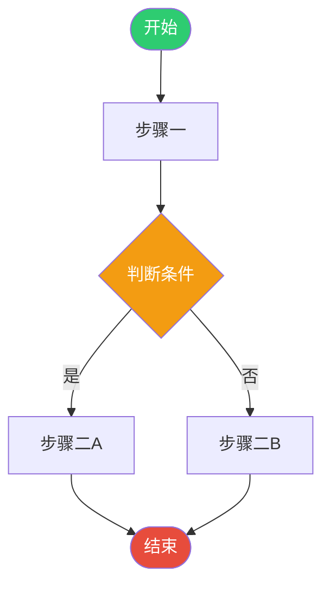
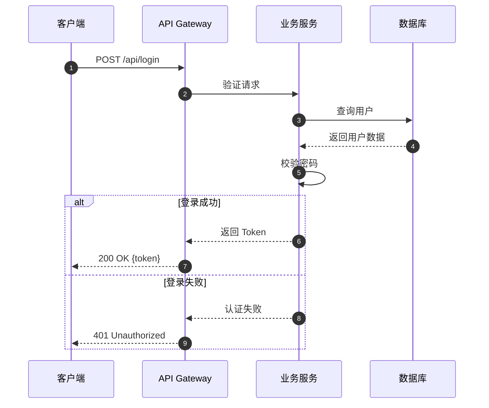
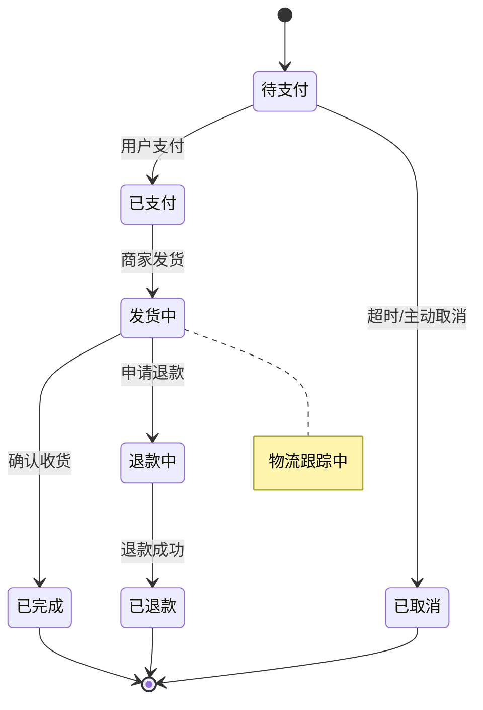
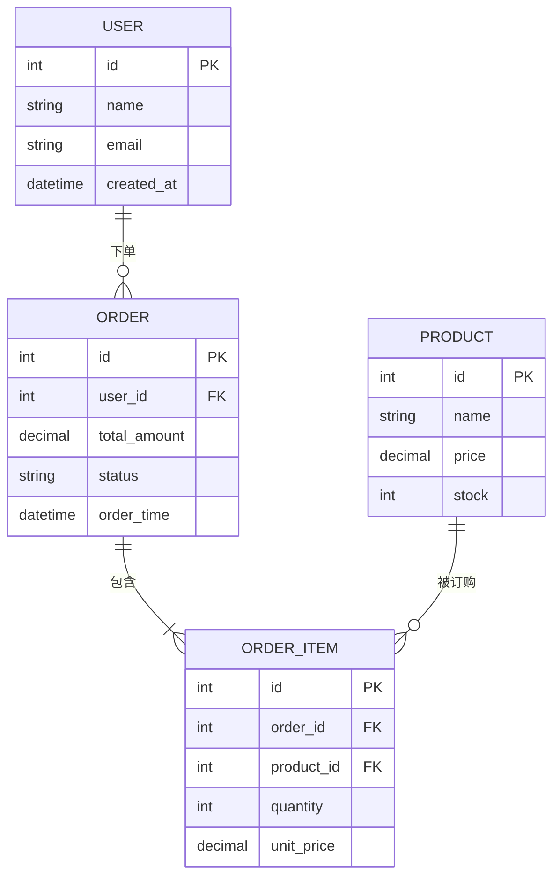
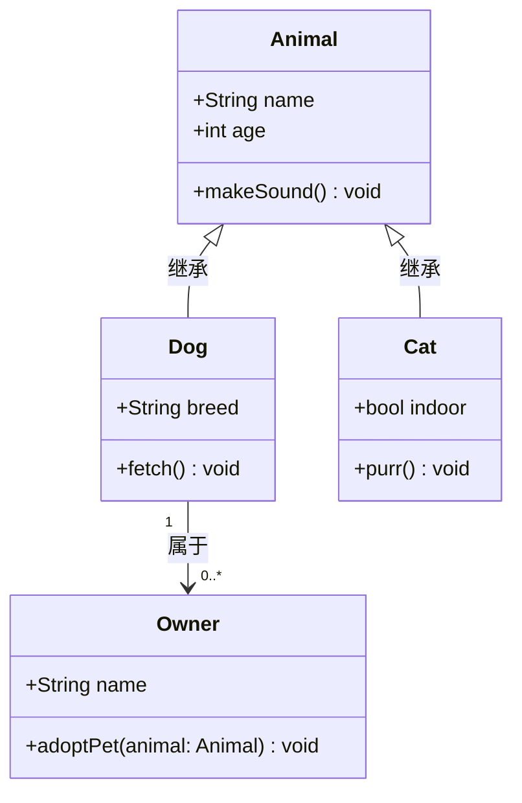
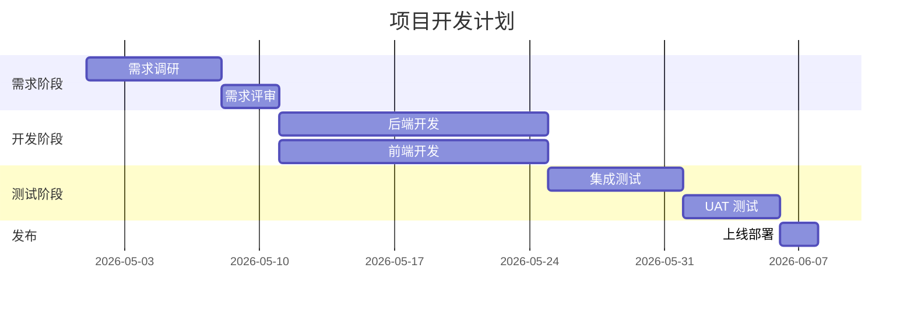
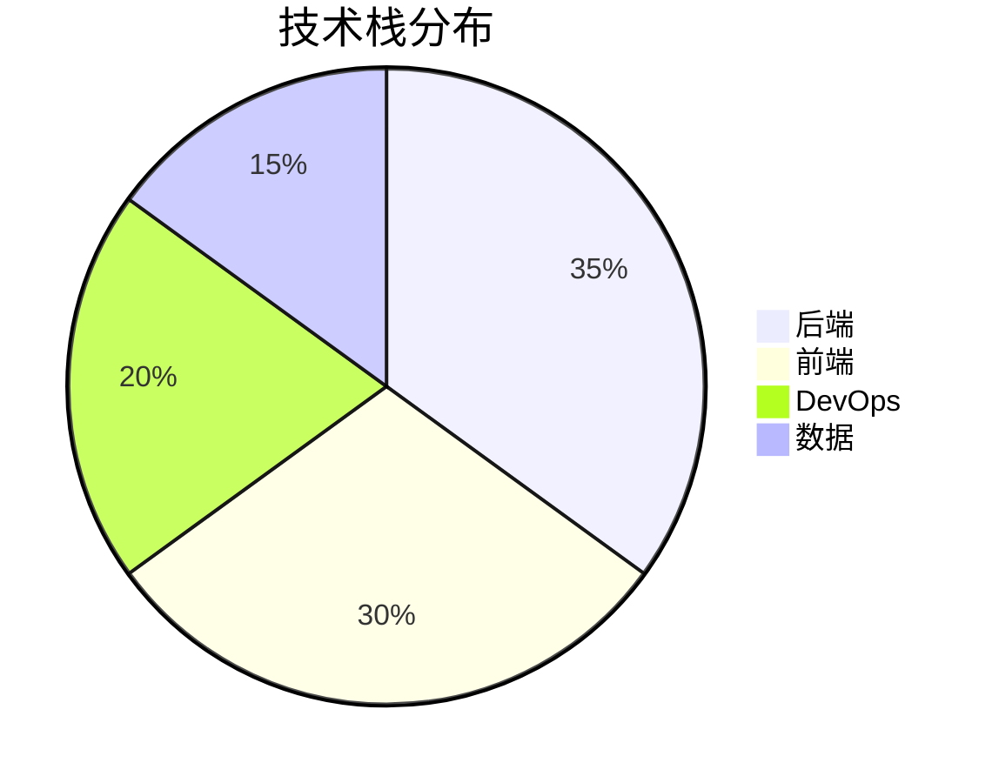
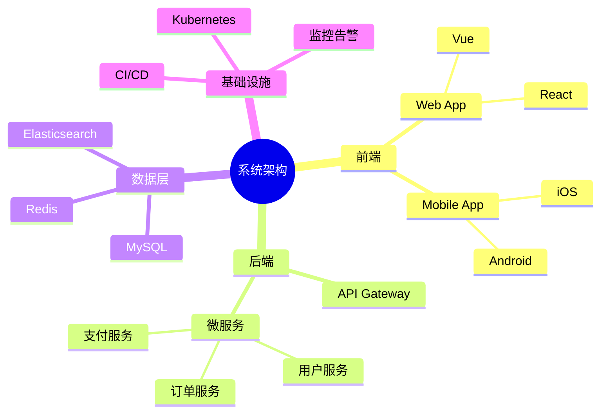
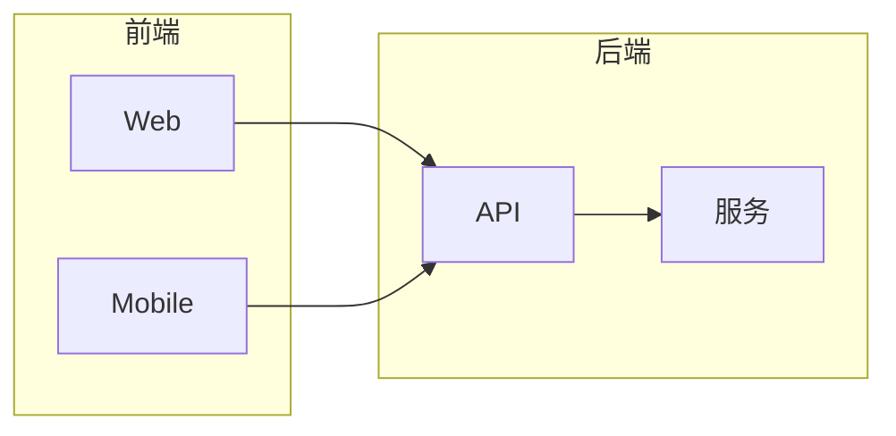

# Mermaid 语法速查与模板

本文件提供 Mermaid 图表语法速查和常用模板，供 diagram-builder skill 使用。

---

## 流程图（Flowchart）



**节点形状**：
| 语法 | 形状 |
|------|------|
| `A[文字]` | 矩形 |
| `A(文字)` | 圆角矩形 |
| `A([文字])` | 胶囊形（开始/结束） |
| `A{文字}` | 菱形（判断） |
| `A[(文字)]` | 圆柱（数据库） |
| `A((文字))` | 圆形 |
| `A>文字]` | 标签形 |

**方向**：`TD`（上下）、`LR`（左右）、`BT`（下上）、`RL`（右左）

---

## 时序图（Sequence Diagram）



**消息类型**：
- `A->>B: 消息` — 实线箭头（同步）
- `A-->>B: 消息` — 虚线箭头（返回/异步）
- `A-)B: 消息` — 异步（无箭头实线）
- `A-xB: 消息` — 带 × 的箭头（失败）

**控制块**：
```
loop 每10秒轮询
    ...
end

alt 条件A
    ...
else 条件B
    ...
end

opt 可选操作
    ...
end

par 并行操作1
    ...
and 并行操作2
    ...
end
```

---

## 状态机（State Diagram v2）



---

## ER 图（Entity Relationship）



**基数符号**：
| 符号 | 含义 |
|------|------|
| `\|\|` | 有且仅有一个 |
| `o\|` | 零或一个 |
| `\|{` | 一或多个 |
| `o{` | 零或多个 |

---

## 类图（Class Diagram）



---

## 甘特图（Gantt）



---

## 饼图（Pie Chart）



---

## 思维导图（Mindmap）



---

## 常用技巧

### 添加链接
```
A --> B
click A "https://example.com" "跳转说明"
```

### 子图（Subgraph）


### 自定义样式
```
style nodeId fill:#color,stroke:#color,color:#color
classDef myClass fill:#f9f,stroke:#333
class nodeId myClass
```

### 图表配置
```
%%{init: {'theme': 'base', 'themeVariables': {'primaryColor': '#3498db'}}}%%
```

可用主题：`base`、`default`、`dark`、`forest`、`neutral`
